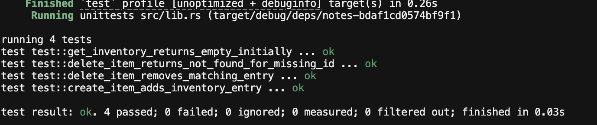

<h1 align="center">Stellar Inventory DApp</h1>

<h3 align="center">Decentralized inventory management on Stellar Soroban.</h3>

<p align="center">
  Build, manage, and verify inventory records on-chain with a Rust smart contract,<br />
  a Next.js frontend, Freighter wallet integration, and automated contract testing.
</p>

<p align="center">
  <a href="https://stellar.org"></a>
  <a href="https://developers.stellar.org/docs/build/smart-contracts"></a>
  <a href="https://www.rust-lang.org/"></a>
  <a href="https://nextjs.org/"></a>
  <a href="https://github.com/zinct/inventory-dapps/actions"></a>
  <a href="https://developers.stellar.org/docs/networks"></a>
</p>

<p align="center">
  <a href="#level-3-submission-checklist">Level 3 Checklist</a> ·
  <a href="#live-demo">Live Demo</a> ·
  <a href="#screenshots">Screenshots</a> ·
  <a href="#getting-started">Getting Started</a> ·
  <a href="#smart-contract">Smart Contract</a> ·
  <a href="#ci-cd">CI/CD</a> ·
  <a href="#test-results">Test Results</a>
</p>

<p align="center">
  <strong>Repository:</strong> <a href="https://github.com/zinct/inventory-dapps">zinct/inventory-dapps</a><br />
  <strong>Contract:</strong> <code>CAJVFVM4DT6ZR634PU3MRFGP5FHDE5AAHCZXR4F54KWKZV25YQ7LYB2Z</code>
</p>

---

## Level 3 Submission Checklist

| Requirement | Status | Details |
| --- | --- | --- |
| Complete README documentation | ✅ | This document |
| 10+ meaningful commits | ⏳ | See [Commit History](#commit-history) |
| Live demo link | ⏳ | [Placeholder — update before submission](#live-demo) |
| Contract deployment address | ✅ | `CAJVFVM4DT6ZR634PU3MRFGP5FHDE5AAHCZXR4F54KWKZV25YQ7LYB2Z` |
| Mobile responsive UI screenshot | ✅ | [`docs/mobile.png`](./docs/mobile.png) |
| CI/CD pipeline screenshot | ⏳ | Add image to `docs/ci.png` |
| Test output (3+ passing tests) | ✅ | [`docs/test.png`](./docs/test.png) — 4 passing unit tests |

---

## Live Demo

> **Placeholder:** Replace the URL below with your deployed frontend (Vercel, Netlify, etc.)

**Demo URL:** `https://your-demo-url.vercel.app`

**Network:** Stellar Testnet  
**Wallet required for writes:** [Freighter](https://www.freighter.app/)

---

## On-Chain Verification

### Contract Deployment

| Field | Value |
| --- | --- |
| **Network** | Stellar Soroban Testnet |
| **Contract ID** | `CAJVFVM4DT6ZR634PU3MRFGP5FHDE5AAHCZXR4F54KWKZV25YQ7LYB2Z` |
| **Explorer** | [View on Stellar Expert](https://stellar.expert/explorer/testnet/contract/CAJVFVM4DT6ZR634PU3MRFGP5FHDE5AAHCZXR4F54KWKZV25YQ7LYB2Z) |
| **RPC URL** | `https://soroban-testnet.stellar.org` |

---

## Screenshots

### Web UI (Desktop)


### Mobile Responsive UI


### CI/CD Pipeline

> **Placeholder:** Capture a screenshot of a successful GitHub Actions run and save it as `docs/ci.png`.


### Test Output (4 Passing Tests)



```text
running 4 tests
test test::get_inventory_returns_empty_initially ... ok
test test::delete_item_returns_not_found_for_missing_id ... ok
test test::delete_item_removes_matching_entry ... ok
test test::create_item_adds_inventory_entry ... ok

test result: ok. 4 passed; 0 failed; 0 ignored; 0 measured; 0 filtered out
```

---

## Project Overview

Stellar Inventory DApp is a full-stack decentralized application that stores inventory records on-chain using a Soroban smart contract. Users can:

- **View** all inventory items (no wallet required)
- **Create** new items (wallet required)
- **Delete** items by ID (wallet required)

The frontend is a minimal black-and-white Next.js app connected to the contract via TypeScript bindings and the Stellar JS SDK.

---

## Architecture

```text
┌──────────────────────────────┐
│   Next.js Frontend (React)   │
│   Freighter Wallet           │
└──────────────┬───────────────┘
               │ Soroban RPC + signed txs
               ▼
┌──────────────────────────────┐
│   InventoryContract (Rust)   │
│   create_item()              │
│   get_inventory()            │
│   delete_item()              │
└──────────────┬───────────────┘
               │ Instance storage
               ▼
┌──────────────────────────────┐
│   Stellar Soroban Testnet    │
└──────────────────────────────┘
```

---

## Tech Stack

| Layer | Technology |
| --- | --- |
| Smart contract | Rust, Soroban SDK v25 |
| Frontend | Next.js 16, React 19, Tailwind CSS 4 |
| Blockchain SDK | `@stellar/stellar-sdk`, `@stellar/freighter-api` |
| Contract bindings | Generated via `stellar contract bindings typescript` |
| CI/CD | GitHub Actions (`.github/workflows/smart-contract.yml`) |
| Package manager | npm (frontend), Cargo (contracts) |

---

## Smart Contract

### Data Structure

```rust
pub struct InventoryItem {
    id: u64,
    name: String,
    quantity: u64,
    price: u64,
    description: String,
}
```

### Functions

| Function | Parameters | Returns | Description |
| --- | --- | --- | --- |
| `get_inventory` | — | `Vec<InventoryItem>` | Returns all stored items |
| `create_item` | `name`, `quantity`, `price`, `description` | `String` | Adds a new item with a random ID |
| `delete_item` | `id` | `String` | Removes an item by ID |

### Response Messages

| Scenario | Message |
| --- | --- |
| Item created | `Item added successfully` |
| Item deleted | `Item deleted successfully` |
| Item not found | `Item not found` |

---

## Frontend Features

- Minimalist white/black UI
- Freighter wallet connect / disconnect with shared global state
- Read-only inventory list without login
- Wallet-gated create and delete actions with visual feedback
- Distinct button colors and cursor states
- Mobile-responsive layout

---

## Project Structure

```text
inventory-dapps/
├── .github/workflows/
│   └── smart-contract.yml      # CI: build + test contract
├── contracts/notes/
│   └── src/
│       ├── lib.rs                # Smart contract
│       └── test.rs               # Unit tests (4 tests)
├── docs/
│   ├── web.png                   # Desktop screenshot
│   ├── mobile.png                # Mobile screenshot
│   ├── test.png                  # Test output screenshot
│   └── ci.png                    # CI screenshot (add before submission)
├── lib/bindings/                 # Generated TypeScript contract bindings
├── src/
│   ├── app/                      # Next.js App Router
│   ├── components/               # UI components
│   ├── hooks/                    # React hooks
│   ├── lib/                      # Stellar constants + contract client
│   └── providers/                # Freighter context provider
├── Cargo.toml                    # Rust workspace
└── package.json                  # Frontend dependencies
```

---

## Getting Started

### Prerequisites

- [Node.js](https://nodejs.org/) 22+
- [Rust](https://rustup.rs/)
- [Stellar CLI](https://developers.stellar.org/docs/tools/cli/install-cli) v25+
- [Freighter](https://www.freighter.app/) browser extension (for write operations)

### 1. Clone the repository

```bash
git clone https://github.com/zinct/inventory-dapps.git
cd inventory-dapps
```

### 2. Build and test the smart contract

```bash
rustup target add wasm32v1-none
stellar contract build
cargo test
```

### 3. Run the frontend

```bash
npm install
npm run dev
```

Open [http://localhost:3000](http://localhost:3000).

### 4. Connect wallet and interact

1. Install Freighter and switch to **Testnet**
2. Fund your account via [Friendbot](https://laboratory.stellar.org/#account-creator?network=test)
3. Click **Connect Wallet** in the app header
4. Add or delete inventory items

---

## CI/CD

The GitHub Actions workflow runs on every push/PR that touches contract files:

**Workflow file:** `.github/workflows/smart-contract.yml`

| Step | Description |
| --- | --- |
| Install Rust + `wasm32v1-none` | Build target for Soroban |
| Install Stellar CLI v25.2.0 | Official CLI action |
| `cargo fmt --check` | Formatting validation |
| `stellar contract build` | Compile WASM |
| `cargo test --workspace` | Run all contract unit tests |

---

## Test Results

The smart contract includes **4 unit tests** covering core functionality:

| Test | Description |
| --- | --- |
| `get_inventory_returns_empty_initially` | Empty state on fresh contract |
| `create_item_adds_inventory_entry` | Create flow and field persistence |
| `delete_item_removes_matching_entry` | Delete by ID |
| `delete_item_returns_not_found_for_missing_id` | Error handling for missing ID |

Run locally:

```bash
cargo test
```

---

## Commit History

> **Note:** Level 3 requires **10+ meaningful commits**. Ensure your repository history includes granular commits for the work below before final submission.

| # | Type | Description |
| --- | --- | --- |
| 1 | `feat` | Initialize Soroban inventory smart contract |
| 2 | `feat` | Implement `create_item`, `get_inventory`, `delete_item` |
| 3 | `test` | Add unit tests for all contract functions |
| 4 | `ci` | Add GitHub Actions workflow for contract build and test |
| 5 | `feat` | Scaffold Next.js frontend at project root |
| 6 | `feat` | Generate TypeScript contract bindings |
| 7 | `feat` | Integrate Freighter wallet connection |
| 8 | `feat` | Build inventory list, create form, and delete actions |
| 9 | `style` | Apply minimalist UI with button feedback and auth gating |
| 10 | `fix` | Share wallet state via React Context provider |
| 11 | `docs` | Update README for Level 3 submission requirements |

---

## Deploy Frontend (Vercel)

```bash
npm run build
```

Network and contract settings are hardcoded in `src/lib/stellar.ts` for Stellar testnet, so no environment variables are required on Vercel.

---

## Deploy / Upgrade Contract

```bash
cd contracts/notes
stellar contract build

stellar contract deploy \
  --wasm ../../target/wasm32v1-none/release/notes.wasm \
  --network testnet \
  --source YOUR_KEY_NAME
```

After deploying, update `CONTRACT_ID` in `src/lib/stellar.ts` and regenerate bindings:

```bash
stellar contract bindings typescript \
  --contract-id YOUR_NEW_CONTRACT_ID \
  --network testnet \
  --output-dir lib/bindings \
  --overwrite

npm run build:bindings
```

---

## Future Improvements

- Update existing inventory items
- Role-based access control
- Inventory categories and search
- On-chain event indexing
- Multi-warehouse support

---

## License

Apache-2.0 (Stellar ecosystem standard)

---

**Stellar Inventory DApp** — Decentralizing inventory management with Stellar & Soroban
